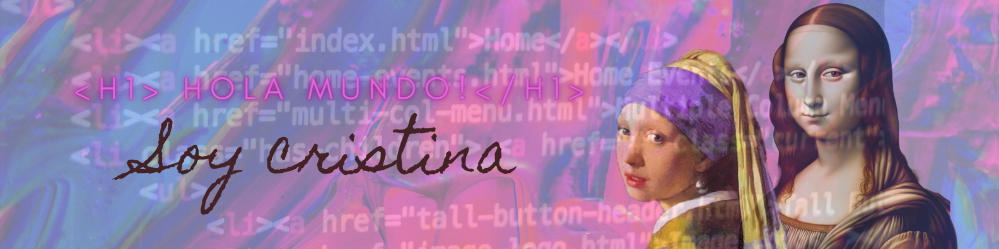

<h1 align="center">Hi everyone💜! I'm Cristina</h1>
<h3 align="center">A junior front-end developer</h3>

## Welcome to my Git 

I am an art historian converted into a web developer, Adalaber from Promo Úrsula

Right now I'm:

- In active search of my opportunity in the TECH world 🔍
- Strengthening my knowledge in **Java Script**, **React.js**, **Node.js**, and **MongoDB**.🌱
- Eager to learn more technologies 📚

## Technologies

## Contact 📫

